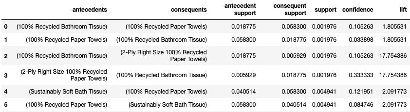
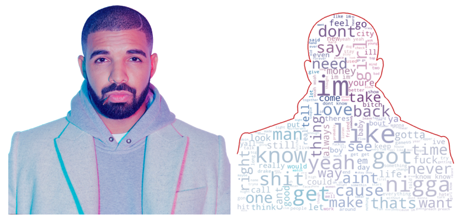
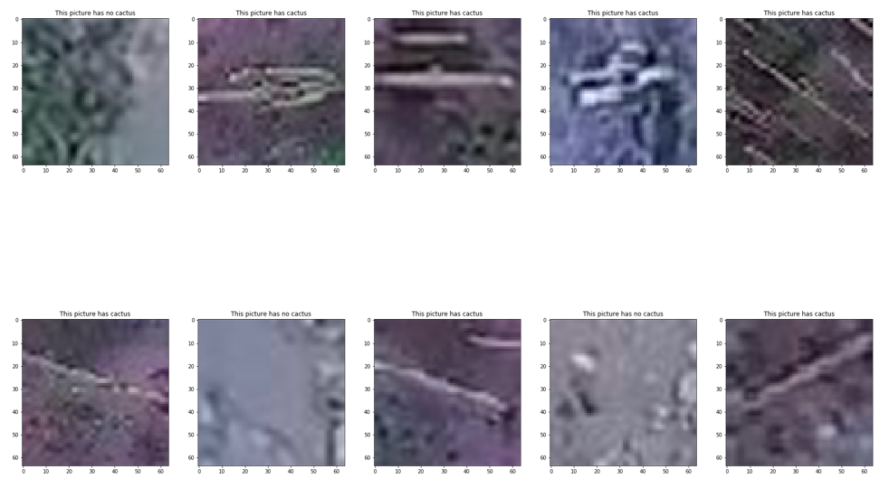
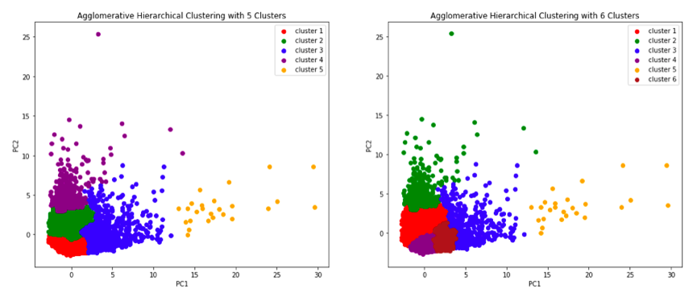
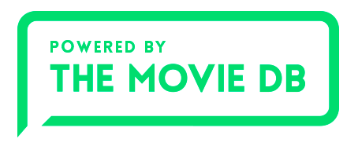
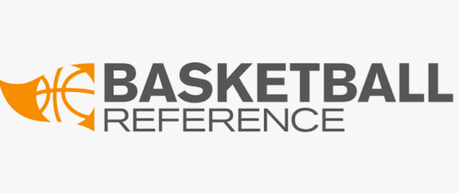

# Data Science Portfolio

## About Me

I am a Sophomore, CS Undergrad @ The University of Texas at Dallas.  More information about my academic journey can be found in [my website](http://andreduong.me).

## Projects

This is a list of the projects I worked on or currently working on. It is updated regularly. Click on the projects to see full analysis and code.

---

### [Market Basket Analysis with SQL, Association Rule, and the Apriori Algorithm](https://github.com/andreduong/market-basket-analysis)

The dataset is anonymized and contains a sample of over 3 million grocery orders from more than 200,000 Instacart users. For each user, we provide between 4 and 100 of their orders, with the sequence of products purchased in each order. In this project, I will use this anonymized data from Instacart on customer orders over time to practice some SQL queries with PostgreSQL database, then try to find interesting purchase combinations with Association Analysis and the Apriori algorithm.

What I learned from this project:

* Utilized SQLAlchemy, which gives full power and flexibility of SQL

* Practiced SQL queries: CREATE, SELECT, FROM, JOIN, DROP, INNER JOIN, etc.

* Worked with PostgreSQL database

* Association Analysis: a classic business intelligence data mining problem

* Implemented Apriori algorithm with Python library MLxtend

**Keywords:** SQL, SQLAlchemy, PostgreSQL, Association Rule (Support/Confidence/Lift), Association Analysis, Apriori algorithm, MLxtend

---

### [Drake Analysis: A Deeper Look Into The Discography Of Canada's Rap King](https://github.com/andreduong/drake-analysis)

Hip-Hop is my favorite music genre of all time, and Drake is an artist I've listened to for years. Many text mining analyses have been performed on rap lyrics, but I haven't seen enough works that actually dig deeper into one specific artist's discography (or in this case, Drake's discography). In this project, I apply various Natural Language Process techniques to analyze Drake's lyrics:

* Scraped 500 songs info with lyrics from genius.com

* Performed data wrangling and exploratory data analysis with Matplotlib and Seaborn

* Applied various NLP techniques: word embedding, bag-of-words, tokenization with NLTK, NER with SpaCy

* Topic modeling with LDA, dimensionality reduction with t-SNE, interactive topic visualization with pyLDAvis

**Keywords:** NLP, web scraping, data wrangling, EDA, word embedding, bag-of-words, tokenization, NLP, SpaCy, Named Entity Recognition (NER), Topic Modeling, Latent Dirichlet Allocation (LDA), dimensionality reduction, t-SNE, interactive visualization, pyLDAvis

---

### [Cactus Identification: A Walkthrough from CNN to Transfer Learning with Pre-Trained Model VGG16](https://github.com/andreduong/aerial-cactus-identification)

This project was my introduction to the world of Computer Vision using Deep Learning. In this write-up, I will do a walkthrough of the whole classifier making process, including:

* Data preprocessing

* Build a Convolutional Neural Network 

* Evaluate the model

* Make tweaks to improve performance: data augmentation, progressive resizing

* Apply transfer learning with a pre-trained model (VGG16)

* Test the model by making prediction on first 10 images from the test set

* Experiment with OpenCV

**Keywords:** Neural Network, CNN, Data Augmentation, Progressive Resizing, Transfer Learning, Pre-Trained Model, VGG16, OpenCV

---

### [Credit Card Clustering](https://github.com/andreduong/credit-card-clustering)

The sample Dataset summarizes the usage behavior of about 9000 active credit card holders during the last 6 months. You need to develop a customer segmentation to define marketing strategy from the dataset.

In this project, I:

* Developed marketing strategies for six segmented customer groups

* Experimented with clustering models (K-Means, Agglomerative Hierarchical Clustering, Gaussian Mixture)

* Practiced data cleaning, exploratory data analysis, data visualization, feature extraction using PCA

**Keywords:** Data Cleaning, EDA, Feature Extraction, PCA, Inertias, Silhouette Scores, K-Means Clustering, Agglomerative Hierarchical Clustering, Gaussian Mixture Clustering

---

### [Box Office Prediction: A Project](https://github.com/andreduong/box-office-prediction)

In a world where movies made an estimated $41.7 billion in 2018, the film industry is more popular than ever. But what movies make the most money at the box office? How much does a director matter? Or the budget? Having been following box office as a side hobby for a while, this project was definitely one of my favorites to do.

In this project, I went through the entire data science lifecycle, including:

* Data wrangling/preprocessing

* Exploratory data analysis/Data visualization

* Feature engineering

* Pipelines Building

* Dimensionality reduction with TruncatedSVD

* Building various boosting models (XGBoost, LightGBM)

* Applying simple ensemble method (stacking)

**Keywords:** Data Wrangling, EDA, Feature Engineering, Dimensionality Reduction, SVD, XGBoost, LightGBM, Ensemble Learning, Stacking

---

### [Dog Or Cat - A Simple Computer Vision Flask API](https://github.com/andreduong/dog-vs-cat-flask-api)

When a data scientist develops a machine learning model, the ultimate goal is to make it available in production. However, a lot of the times we just want a simple way to call a REST API and get predictions using the current classifier. In this project, I created a Computer Vision Flask API to classify dog/cat and find the most dominant color in a picture.

**Keywords:** Flask, REST API, Computer Vision, Model Deployment

---

### [Scraping NBA Data](https://github.com/andreduong/my-first-web-scraper)

I am a big NBA fan. As the season has ended, here we are scraping the top NBA player stats this season. In this project, I tried web scraping for the first time ever using BeautifulSoup, and then performed some brief data analysis.

**Keywords:** Web Scraping, BeautifulSoup, EDA
